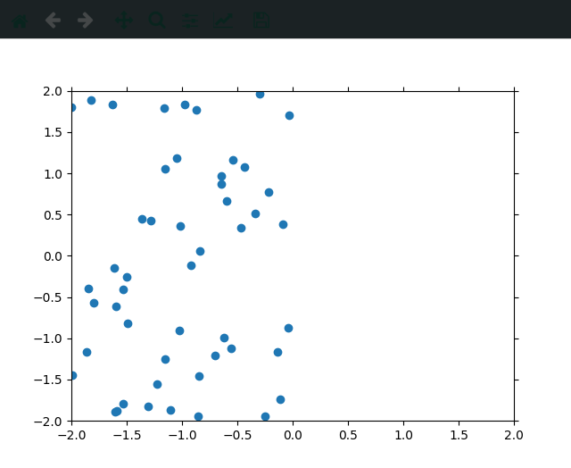
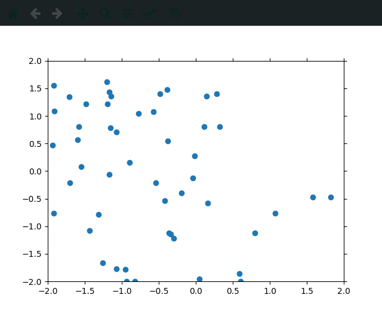
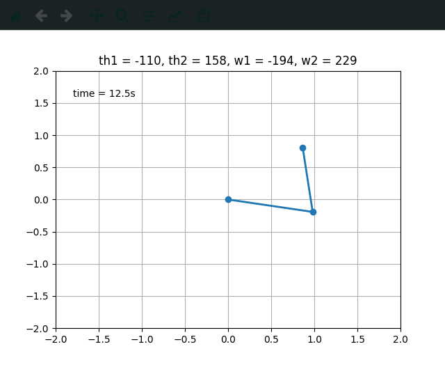

# Demonštrácia fyzikálnych zákonov

V tomto repozitári možno nájsť niekoľko jednoduchých skriptov napísaných v
Pythone vhodných na vysvetľovanie niektorých fyzikálnych princípov. Menovite: 

- Difúziu a Náhodná prechádzka
- Chaotický pohyb spriahnutého kyvadla
- Fázové prechody Isingovho modelu

## Difúzia a Náhodná prechádzka

Predstavme si, že máme opitého námorníka. Po celej noci strávenej v krčme vyjde
zo svojeho obľúbeného podniku do temnej, studenej noci. Asi by chcel ísť domov
ale je tak intoxikovaný, že nevie kde je, nevie kde býva, ani to ako sa volá.
Nie je dokonca schopný ani len kontrolovať svoj pohyb. Uvažujme, že v
pravidelných časových okamihoch sa mu podarí spraviť jeden krok - buď sa pohne
doprava alebo do ľava. Uvažujeme, že každý krok má rovnakú dĺžku. To, ktorým
smerom sa pohne je úplne náhodné a žiadny smer nie je preferovaný - veď
námorník aj tak nevie kde ja a kam ide! Námorník potom spraví $N$ krokov a
nakoniec niekde odpadne a zaspí. To, kde bude námorník po budúcom kroku závisí
iba od jeho aktuálnej polohy - chudák nie je v stave, aby vedel robiť nejaké
sofistikované rozhodnutia. Takýto typ pohybu vo fyzike nazývame *náhodná
prechádzka*.

Žiaľ, náš námorník je beznádejný a notoricky známy alkoholik a do krčmy sa
vracia každý večer, takže vieme pozorovať jeho náhodný prechádzku a robiť si
dôkladné záznamy o jeho pohybe a o tom, kde na koniec skončí. Samozrejme, jeho
správanie nás, zvedavých vedcov, poviedie k rôznym otázkam:

 - Ako ďaleko od krčmy môže námorník skončiť?
 - Priemerne ako ďaleko sa od krčmy námorník dostane?
 - Vieme niečo povedať o našich záznamoch jeho pohybu na základe štatistiky a pravdepodobnosti?

## Náhodná prechádzka vo vyšších rozmeroch
Vo fyzike máme niečo, čo sa nazýva *Galileiho princíp nezávislosti pohybov* -
ten nám hovorí, že ak máme pohyb zložený z niekoľkých zložiek, tak jeho
výsledok je rovnaký ako keby sme vykonali tieto pohyby jeden za druhým a každý
začali tam, kde skončil predchádzajúci.

Na základe toho vieme vytvoriť pohyb, ktorý je zložený z náhodných prechádzok pozdĺž osí daného priestoru.

## Náhodná prechádzka ako vedecký model a jej použitie

Nie je ťažké si predstaviť, že namiesto opitého námorníka by sme mohli mať aj
niečo iné, napríklad častice. Vieme ňou však popisovať aj iné náhodné procesy
(a dokonca aj procesy, ktoré v skutočnosti nie sú náhodné) - jej aplikácie
vieme nájsť vo *fyzike, ekológii, psychológii, informatike, chémii, biológii a
ekonomike*. Keď začneme skracovať časové intervaly medzi krokmi a ich dĺžku,
tak sa náhodná prechádzka limitne zmení z nespojitého (*diskrétneho*) procesu
na spojitý (*kontinuálny*). Takýto limitný proces nazývame *Wienerov proces*
alebo *Brownov pohyb*. Ten spoznávame už na základnej škole. Ide o
neusporiadaný, náhodný pohyb molekúl prenikajúcich medzi molekuly inej látky.
Keďže počítače majú problém so spojitým, tak častokrát aproximujeme Brownov
pohyb náhodnou prechádzkou.

V ekonomike sa používa na modelovanie cien akcií a finančných derivátov, v
genetike sa ňou popisuje tzv. genetický drift, v matematickej ekológii sa takto
popisuje náhodný pohyb zvierat, v informatike sa používa na odhad rastu
veľkosti internetu, v neurológii sa používa na modelovanie vzruchov v
neurónoch, atď.

## Difúzia

## Chaotický pohyb spriahnutého kyvadla

[Spriahnuté kyvadlo](https://en.wikipedia.org/wiki/Double_pendulum) pozostáva z
dvoch kyvadiel, pričom jedno je zavesené na závaží druhého. Napriek tomu, že
správanie tohoto systém riadené dvoma jednoduchými diferenciálnymi rovnicami,
pohyb kyvadla môže byť veľmi zložitý a chaotický. 

## Na spustenie potrebujete

Potrebujete mať Python 3 a nasledujúce knižnice:
- numpy
- matplotlib
- scipy
- tkinter

Všetky knižnice možno jednoduch nainštalovať pomocou `pip install <knižnica>`.
Potom už možno kód spustiť cez terminál pomocou `python <súbor.py>` alebo na
Windowse aj dvojkliknutím na súbor. 
